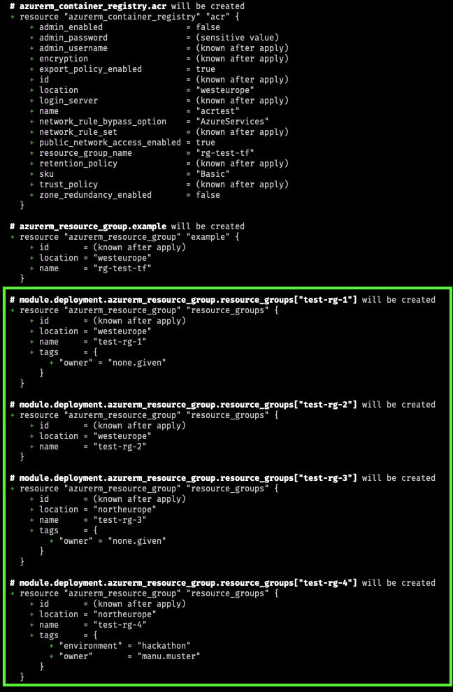

# KfW DevOps Challenge

## Challenge 5 - Infrastructure as Code

[Home](../../README.md) - [Back >](../challenge04/README.md)

### Intro

Unternehmen aller Größenordnungen nutzen Cloud-basierte Dienste für Anwendungsworkloads. Die Entwicklungsteams, die diese Cloud-basierten Dienste nutzen, sind in der Lage, unabhängiger von den betrieblichen Zwängen der zugrunde liegenden Infrastruktur zu arbeiten. Für die meisten Unternehmen bedeutet dies, einen Übergang zu bewältigen:

* von einem relativ statischen Pool homogener Infrastrukturen in speziellen Rechenzentren,
* zu einer verteilten Flotte von Servern, die sich auf einen oder mehrere Cloud-Anbieter verteilen.

Um diese Umstellung zu bewältigen, behandeln viele Unternehmen ihre Cloud-basierte Infrastruktur als Code und stellen sie gemeinschaftlich bereit. [Terraform](https://www.terraform.io/docs/index.html) verwendet Infrastruktur als Code, um jede Cloud-Infrastruktur bereitzustellen. Terraform bietet einen kollaborativen Arbeitsablauf für Teams zur sicheren und effizienten Erstellung und Aktualisierung von Infrastruktur in großem Umfang.

### Tasks

In dieser Aufgabe geht es darum, sich mit der command line interface (CLI) von Terraform vertraut zu machen und den Templating-Mechanismus zusammen mit dem [Azure-Provider](https://www.terraform.io/docs/providers/azurerm/index.html) zu verwenden, um die Infrastruktur aus Challenge 4 zu deployen.

Die Aufgaben für diese Herausforderung sind:

1. Terraform herunterladen und lokal einrichten
   
2. Erstellt ein Terraform File, die die resource group und ACR bereitstellen wird

3. Führt das Terraform File aus, um die resource group und ACR in der Cloud zu erstellen

4. Dokumentiert in der README.md die Befehle/Kommandos, die ihr benutzt habt und ladet (pusht) euer Terraform File in eurem Git Repository hoch

5. _Bonus_: `locals, variables, expressions & module`  
   Terraform verwendet als Syntax HCL (Hashicorp Configuration Language) und erlaubt durch eine vielzahl an Konstrukten flexiblen Code zu schreiben. Wir wollen uns, wie es auch in realen Setups der Fall ist, ganz nach dem Prinzip von DRY (Dont repeat yourself) nun einige der Konstruke anschauen, es gibt hier multiple Lösungen, aber als Anhaltspunkt empfiehlt es sich folgende anzuschauen `locals, variables, expressions  & functions (for, merge, try) & modules`.
   - Erweitere nun dein `main.tf`, sodass multiple resourcen gruppen erstellt werden können, bei denen man simple Werte wie "location" und "tags" als Variable mitgeben kann. Nach dem DRY Prinzip wollen wir aber nicht einfach pro Resource Gruppe einen Block schreiben, sondern uns hier Schleifen zu nutze machen.
   - Lagere das erstellen von multiplen Resourcen Gruppen in ein Modul aus, damit in Zukunft auch andere davon gebrauch machen können
   - Als Test verwende folgende Input Variable
   ```json
    {
        "spec": {
            "resourcegroups": {
                "test-rg-1": {},
                "test-rg-2": {
                    "location": "West Europe",
                    "tags": {}
                },
                "test-rg-3": {
                    "location": "North Europe"
                },
                "test-rg-4": {
                    "location": "North Europe",
                    "tags": {
                        "owner": "manu.muster",
                        "environment": "hackathon"
                    }
                }
            }
        }
    }
    ```
    Als Output sollen die Resourcengruppen aus dem gegebenen Input hinzugefügt werden (die resource group und acr aus den vorigen Schritten, können stehen gelassen werden). `location = "westeurope"` und ` tags = { "owner" = "none.given" }` sind wie ihr seht nicht Teil vom test input, diese sollen als default Werte angenommen werden. Man beachte hier auch das `module.` keyword im output.

    
### Checklist

- [ ] Terraform CLI ist lokal installiert
- [ ] Erstellt eine Terraform `*.tf` Datei unter Verwendung des Azure-Providers
- [ ] Cloud resourcen wurden via Terraform erstellt
- [ ] Terraform Datei ist im Git Repository hochgeladen

### Lernmaterial

- [Terraform Dockmentation](https://www.terraform.io/intro)
- [Terraform Azure Provider](https://registry.terraform.io/providers/hashicorp/azurerm/latest/docs)
- [Azure Naming Rules](https://docs.microsoft.com/en-us/azure/azure-resource-manager/management/resource-name-rules)


[Home](../../README.md) - [Next >](../challenge06/README.md)

