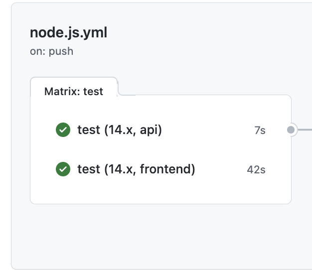
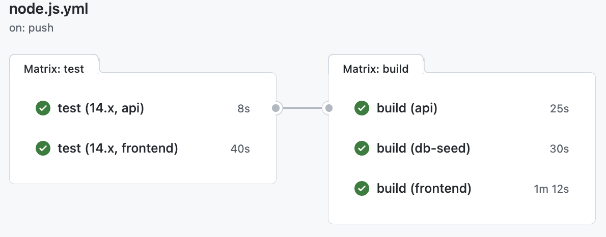

# KfW DevOps Challenge

## Challenge 6 - Continuous Integration

[Home](../../README.md) - [Back >](../challenge05/README.md)

### Intro

Nun müssen wir unseren Quellcode mit seinem Ziel verbinden. Der erste Schritt auf diesem Weg ist die kontinuierliche Integration (Continuous Integration, CI). 

Kontinuierliche Integration ist der Prozess der Zusammenführung lokaler Codeänderungen in die Quellcodekontrolle (soure control) und umfasst Schritte zur automatischen Erstellung und/oder Prüfung des Codes. Wenn sie effektiv durchgeführt wird, ermöglicht die kontinuierliche Integration den Entwicklern eine schnelle Iteration und Zusammenarbeit und hilft sicherzustellen, dass neu hinzugefügter Code die aktuelle Anwendung nicht beschädigt. 

Lest die folgenden Artikel:
- [Über kontinuierliche Integration](https://docs.github.com/en/actions/building-and-testing-code-with-continuous-integration/about-continuous-integration)
- [Einrichten der kontinuierlichen Integration mithilfe von Workflow-Vorlagen](https://docs.github.com/en/actions/building-and-testing-code-with-continuous-integration/setting-up-continuous-integration-using-github-actions)

### Tasks

In dieser Aufgabe fügt ihr eine Pipeline zum automatischen Testen (test) und Bauen (build) der Anwendung hinzu.

1. Erstellt einen neuen `Node.js`-Workflow aus dem GitHub Actions Marketplace. Klickt in eurem Repo im oberen Menü auf Aktionen > Neuer Workflow (Schaltfläche) > scrollt nach unten zum Abschnitt "Kontinuierliche Integrationsworkflows" und richtet Aktion "Node.js" ein.

2. Überprüft das Layout des Workflows. Es gibt einen einzigen Job (mit dem Namen 'build') mit mehreren Schritten. Bennent es auf 'test' um.

3. Der automatisch erstellte Workflow wird einen Fehler werfen, da wir eine andere Verzeichnis Struktur haben mit `/application`, und den darunter liegenden Subprojekten `frontend, api`. Diese Struktur wird auch "monorepo" genannt, deshalb sind folgende Änderungen notwendig.
   - Entfernt von der Matrix die Node Versionen 16 und 18
   - Erweitert die Matrix um eine zusätzliche Dimension `project` mit den Werten `frontend, api`
   - Da unsere Dateien nicht im Root liegen, müssen wir unseren jobs vorher noch "sagen" wo sie die Schritte ausführen sollen. Schaut euch [die Doku](https://docs.github.com/en/actions/using-workflows/workflow-syntax-for-github-actions#jobsjob_iddefaultsrun) an bzgl. "default working directory".
   - Der "setup-node" Schritt braucht ebenfalls eine Anpassung um mit einer monorepo Struktur zurecht zu kommen. Schaut euch [cache-dependency-path](https://github.com/actions/setup-node#caching-global-packages-data) an für Files in Unterverzeichnissen (subdirectories).

4. Fügt einen Audit Schritt in den Workflow ein, der die von den Applikationskomponenten genutzten Abhängigkeiten/Bibliotheken auf bekannte Sicherheitslücken überprüft. Im aktuellen Zustand der Applikation werden einige Sicherheitslücken unterschiedlicher Kritikalität gefunden, sodass der Workflow fehlschlägt. Da das Fixen der Abhängigkeiten nicht Teil dieser Challenges ist, kann der Exit Code hier ignoriert werden, sodass der Audit Schritt rein zu Anzeige- bzw. Logzwecken besteht. Sofern Zeit und Lust besteht, kann natürlich versucht werden, die durch den Audit aufgedeckten Lücken zu beheben.

5. Implementiert ein Linting der JavaScript Codebase im Workflow. Dieses kann recht simpel gehalten werden. Es reicht beispielsweise eine Überprüfung, ob jede Anweisung mit einem Semikolon abgeschlossen wird. Es genügt, das Linting für das `api` Projekt durchzuführen. Sofern noch Zeit verfügbar ist, kann das Linting natürlich auch noch auf das `frontend` Projekt ausgeweitet werden.

6. Testet euren workflow, indem ihr eine kleine Änderung macht am Code (z.b. Kommentar adden). Commitet und pusht, und geht sicher dass euer workflow erfolgreich abschließt.

Wenn ihr folgende Bild sehen könnt, habt ihr es erfolgreich geschafft eure Pipeline einzurichten. Herzlichen Glückwunsch!
Auf diesem Workflow können wir weiter aufbauen und den Job hinzufpgen um die Applikation automatisch zu bauen (build step).

1. Fügt einen *job* hinzu um die Docker Images von `frontend, api, db-seed` zu bauen und pushen zur eurer privaten Azure Container Registry (**Hinweis**: Für den Login zum ACR verwendet den [Admin Account](https://docs.microsoft.com/en-us/azure/container-registry/container-registry-authentication?tabs=azure-cli#admin-account) für diese Demo. In einem echten Szenario würde man einen technischen User mit beschränkten Rechten nutzen, würde für heute aber den Rahmen sprengen)

An diesem Punkt lösen Änderungen, die gepusht werden, automatisch den Workflow aus … und das ist Continuous Integration!

### Checklist

- [ ] Änderungen triggern automatisch den workflow
- [ ] Ein entsprechendes Docker Image ist im ACR nach jedem erfolgreichem Durchlauf verfügbar

### Lernmaterial

- [Intro zu GitHub Actions](https://docs.github.com/en/free-pro-team@latest/actions/learn-github-actions/introduction-to-github-actions)
- [Node.js Action to build and test](https://docs.github.com/en/actions/automating-builds-and-tests/building-and-testing-nodejs)
- [Understanding workflow path filters](https://docs.github.com/en/free-pro-team@latest/actions/reference/workflow-syntax-for-github-actions#onpushpull_requestpaths)
- [Github Actions default working directory](https://docs.github.com/en/actions/using-workflows/workflow-syntax-for-github-actions#jobsjob_iddefaultsrun)

[Home](../../README.md) - [Next >](../challenge07/README.md)