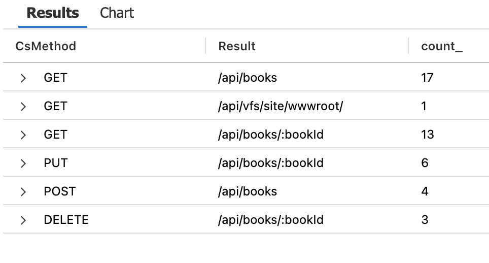
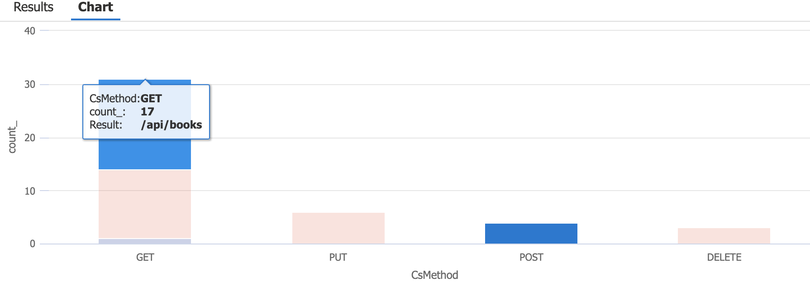

# KfW DevOps Challenge

## Challenge 10 - Dashboards & Monitoring

[Home](../../README.md) - [Back >](../challenge09/README.md)

### Intro

Um den Kreis unserer DevOps-Reise zu schließen, müssen wir verstehen, was in unserer bereitgestellten Umgebungen passiert. Die Leistung unserer Applikation im Auge zu behalten und zu sehen wie unsere Applikation genutzt wird ist unerlässlich für das Betreiben einer erfolgreichen Applikation. Ein weiterer Aspekt der Überwachung ist von Problemen zu erfahren, bevor Benutzer beginnen sich darüber zu beschweren.

1. [What is Monitoring?](https://docs.microsoft.com/en-us/azure/devops/learn/what-is-monitoring)

### Tasks

In dieser Herausforderung werden wir uns einige der Telemetriedaten ansehen, die bereits von unserer laufenden Instanz gesammelt wurden. Wir werden auch einen Log Analytics Workspace mit unserem App Service verknüpfen. Dies ermöglicht es uns Logs zu sammeln, für einen längeren Zeitraum zu speichern und via Azure Tools zu analysieren.

1. Erstelle einen Log Analytics Workspace, dass uns in der Azure Cloud als Umgebung und Speicher für Log Data dienen soll.
   
2. Konfiguriert in eurem App Service unter "Diagnostic Settings", dass die Logs in eurem erstellten Log Analytics Workspace gesammelt werden. Wählt dabei alle Log Kategorien aus. Metriken müssen in diesem Beispiel nicht ausgewählt werden.
   
3. Es wird ein wenig dauern, bis die Logs verfügbar sind. Nutzt die Zeit um ein wenig Traffic zu generieren, indem ihr in eurer Applikation Bücher hinzufügt, löscht, entlehnt und zurückgibt (via /admin Seite) und eine kleine Pause einlegt :)

4. Erstellt ein Dashboard im Azure Portal und teilt es. Azure App Service sammelt bereits einige Metriken von Haus aus, geht zu den "Metriken" und fügt eurem Dashboard ein Chart hinzu, dass alle erfolgreichen 2xx Requests anzeigt.

5. Nun ist es an der Zeit anhand der gesammelten Logs ein Dashboard zu basteln. Wir wollen wissen wie oft unsere APIs aufgeschlüsselt anhand der HTTP Methode aufgerufen wurde. Geht dazu zu den Logs und bastelt mit Hilfe der `AppServiceHTTPLogs` ein Chart, dass in einer Tabelle diese Info absteigend nach Anzahl anzeigt, und ein Chart, das dies als Balkendiagramm anzeigt. Die Charts sollten folgendermaßen Aussehen:

 

### Checklist

- [ ] Log Analytics Workspace wurde erstellt
- [ ] In den "Diagnostic Settings" eures App Service ein konfiguriert, dass die Logs in den Log Analytics Workspace gesammelt werden
- [ ] In eurem Azure Dashboard ist ein Chart, dass die erfolgreichen 2xx Aufrufe anzeigt
- [ ] In eurem Azure Dashboard ist ein Chart, dass die Anzahl der API Aufrufe anzeigt in Tabellen Form
- [ ] In eurem Azure Dashboard ist ein Chart, dass die Anzahl der API Aufrufe anzeigt in Balken Form

### Lernmaterial

- [Azure Log Analytics Workspace](https://docs.microsoft.com/en-us/azure/azure-monitor/logs/log-analytics-workspace-overview)
- [Azure Dashboards](https://docs.microsoft.com/en-us/azure/azure-portal/azure-portal-dashboards)
- [Monitor apps in Azure Web Apps](https://docs.microsoft.com/en-us/azure/app-service/monitor-app-service)
- [Azure kusto query language](https://docs.microsoft.com/en-us/azure/data-explorer/kusto/query/)

[Home](../../README.md) - [Next >](../challenge11/README.md)